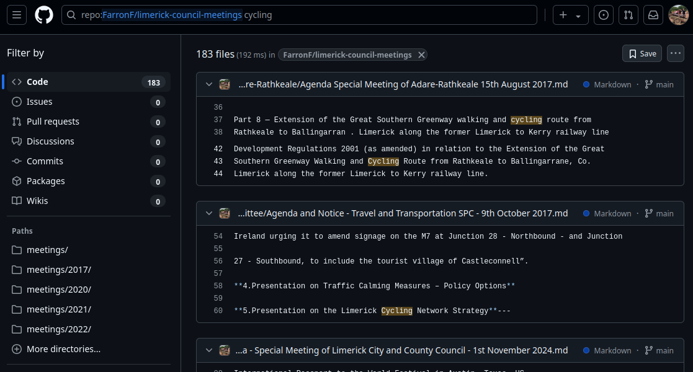

# Limerick Council Meetings

This repository contains all publically available meeting agendas and minutes from Limerick City and County Council. These are generated by PDFs that are uploaded to https://www.limerick.ie/council/your-council/meetings

The purpose of this repo is to allow easy searching of the contents of these PDFs by utilizing github's built in search functionality. It also may be easier to navigate to meetings on specific dates as the limerick.ie website only supports navigation one month at a time.

## Why?
I believe transparency of local government is of vital importance. Currently Limerick City and County Council do not stream or have any video/audio recording of their meetings. While the minutes do not capture absolutely everything in a meeting they are valuable, but are cumbersome to access and not easily searchable, this is to help address that.

## Notes
Scanned pages are read using basic OCR and as such the contents are likely to be inaccurate. These pages have a disclaimer at the top in the markdown.

Files are located in the meeting as they are uploaded to limerick.ie as such minutes will be associated with the meeting where they were adopted rather than the meeting they were recorded. 

When searching across in a year folder minutes for meetings near the end of the year are likely to be adopted at the next relevant meeting in the year after.

Images in PDFs are currently omitted to ensure searching is easier. They will be marked with (Image omitted). To view these images you will need to navigate to the meeting 

## Search Tips
Using github's search at the top of the page, you can search for words or phrases. e.g.

From here you will see various instances where this word appears in documents.

You can further refine the search into relevant paths by clicking one of the "Paths" shown above on the left. This for example can limit the search now to only files from meetings in 2022 

Searching multiple words will only show files where all those words are present anywhere in the file.

If you want to search a specific phrase you should wrap it in quotation marks.

`"bus lane"`

### Useful additional parameters
Additional parameters can be included in a search
#### Search a year/month:
To search only files from meetings in 2025

`path:meetings/2025`

To search only files from meetings in September 2024

`path:meetings/2024/09`

#### Searching a specific districts meetings
Use one of the following to limit searches to a specific district.

`path:**/*Limerick City and County*`

`path:**/*Metropolitan*`

`path:**/*Cappamore-Kilmallock*`

`path:**/*Adare-Rathkeale*`

`path:**/*Newcastle West*`

#### Case sensitive
Add the following to make searches case sensitive

`case:true`

## Creation
This is created by using https://github.com/FarronF/limerick-council-tools

## Potential improvements to this repo:

README.md files at each level to allow for better visibility of meetings in child folders.

More PDFs. (replies to questions next)

Better OCR for scanned pages to improve accuracy

